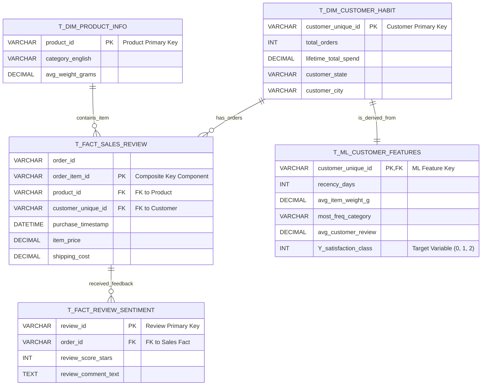

# Olist Insight Engine: E-commerce Data Pipeline and BI Platform

## 🌟 Project Overview

This project simulates a production-grade data pipeline built to transform raw, messy transaction records from the Brazilian e-commerce giant Olist into a clean, optimized **Star Schema** within a SQL Server database. The final, clean data is then used to drive high-impact visualizations in Power BI.

This solution demonstrates expertise in building robust ETL processes, dimensional modeling, and delivering actionable business intelligence.

| Category | Core Architecture | Key Output |
| :--- | :--- | :--- |
| **Architecture** | **Kappa-inspired ETL** (Transient Staging) | **Complete Auditability** and resource efficiency. |
| **Data Engine** | Python (Pandas/SQLAlchemy) | **High-performance** local processing. |
| **Data Warehouse** | MS SQL Server (PostgreSQL/SQLite compatible) | **Star Schema** (Gold Layer). |
| **BI Consumption** | Power BI | **Actionable Dashboards** for Product and Customer Strategy. |

***

## ⚙️ Technical Stack and Tools

| Component | Technology | Primary Role in Project |
| :--- | :--- | :--- |
| **ETL Engine** | Python 3.x, **Pandas, NumPy** | Data merging, cleaning, and aggregation logic. |
| **Database** | **MS SQL Server** | Permanent storage for Audit (Bronze) and Serving (Gold) Layers. |
| **Connectors** | **SQLAlchemy, Pyodbc** | Secure, fast data transfer between Python and SQL Server. |
| **Visualization**| **Power BI** | Final delivery platform for actionable dashboards. |
| **Documentation**| **Mermaid, Draw.io** | Visualizing pipeline flow and database schema. |
| **Code Management**| **PyCharm/VS Code, GitHub** | Development and Version Control. |

***

## 🏗️ Data Architecture & Pipeline Design

The pipeline follows a robust, multi-stage structure (simulating the Kappa principle of a single, powerful processing layer).

### 1. Layer Definitions (SQL Schemas)

| Schema | Layer Role | Data Granularity | Purpose |
| :--- | :--- | :--- | :--- |
| **`bronze`** | **Raw Audit Layer** | Raw, untransformed data from 9 CSV files. | Data integrity validation and audit trail. |
| **`dbo`** | **Transient Silver Stage** | Single, cleaned, item-level Master Fact Table ($\approx 107 \text{K}$ rows). | Intermediate checkpoint for aggregation **(Dropped upon completion)**. |
| **`gold`** | **Serving Layer** | Final, aggregated, modeled tables for consumption. | Source for all Power BI reporting. |

### 2. Key Data Transformations (Silver Layer)

The ETL pipeline was built to solve complex real-world data quality issues:

* **Integrity Fixes:** Fixed severe **data duplication** ($\approx 2 \times$ ingestion errors) across all 9 raw tables.
* **Time Series Cleaning:** Identified and removed **1,382 logically impossible chronological errors** in the order lifecycle timestamps.
* **Imputation:** Performed **Category-Based Median Imputation** on product physical dimensions (`product_weight_grams`) and standardized location data (cities, states).
* **Granularity Control:** Successfully aggregated noisy tables (Geolocation, Reviews, Payments) down to the correct **Order/Item grain** ($\approx 112,650$ rows) for the master merge.

***

## 📊 Gold Layer Output (Star Schema)

The final **`gold`** schema contains the following four optimized tables, designed for rapid reporting in Power BI:

| Table Name | Granularity (Grain) | Key Business Focus |
| :--- | :--- | :--- |
| **`T_DIM_PRODUCT`** | Unique Product | Product Quality, Cost, and Sales Volume. |
| **`T_DIM_CUSTOMER_HABIT`** | Unique Customer | **RFM (Recency, Frequency, Monetary)**, Location, and Loyalty. |
| **`T_Fact_Sales`** | Order Item | Core Measures: Financials (`item_price`, `shipping_cost`), Logistics. |
| **`T_FACT_REVIEW_SENTIMENT`**| Unique Review | Customer Feedback Score and Text Content. |

***

## 📈 Business Intelligence (Power BI) Insights

The final reports provide actionable direction for marketing and operations teams:

### Dashboard: Product Strategy & Quality Performance
* **Visualization:** **Scatter Plot** (`Average Review Score` vs. `Total Items Sold`).
* **Insight:** Pinpoints high-volume, low-quality products (critical risks) for immediate operational review.

### Dashboard: Customer Segmentation & Loyalty
* **Visualization:** **RFM Scatter Plot** (`Total Spent` vs. `Recency Days`).
* **Insight:** Identifies high-value **"Champion"** customers for retention and low-value **"At-Risk"** customers for intervention.
* **Validation:** Donut Chart showing the final distribution of the **three-class satisfaction target** (Bad, Satisfied, Good).

-----

## 📈 Dashboard: Sales Operations & Financial Analysis

This dashboard focuses on the financial health and operational efficiency of the e-commerce platform over time. It helps answer key logistics and profitability questions.

| Visualization | KPI Focus | Business Insight |
| :--- | :--- | :--- |
| **Revenue & Order Trend** | **Financial Health** | Tracks monthly/quarterly revenue and order volume to identify seasonality and overall growth/decline. |
| **Service Performance Correlation** | **Operational Bottlenecks** | Uses a Combo Chart to correlate **Average Delivery Delay** against **Total Orders** to see if poor service quality directly leads to dips in sales volume. |
| **Payment Method Mix** | **Financial Risk/Cost** | Visualizes the total revenue contribution of different payment types (Credit Card, Boleto, Voucher), informing finance on transaction costs. |
| **Geographic Sales Volume**| **Market Focus** | Map visualization showing which states/regions generate the highest total revenue, guiding logistics and inventory placement. |

-----

## 🔗 Final Project Documentation (Mermaid Codes)

### 1\. Data Flow Diagram (DFD): Kappa-inspired ETL

```mermaid
graph TD
    subgraph Local Environment (Python/Pandas)
        A[1. Olist CSV Files] --> B{2. Ingestion to Bronze};
        C{3. Orchestration: Read Bronze & Merge};
        D{4. Aggregation: GroupBy Logic};
    end
    
    subgraph SQL Server (DataWarehouse)
        G[Bronze Schema: 9 Raw Tables (Audit)]
        T[dbo.T_TEMP_SILVER_FACT (Transient Fact)]
        H[Gold Schema: 4 Final Tables (Serving)]
    end
    
    subgraph Consumption Layer
        I[5. ML Pipeline (Training)]
        J[6. Power BI Dashboard]
    end
    
    A --> B
    B --> G
    G -->|Read Data| C
    C -->|Write Transient Fact| T
    
    T -->|Query for Aggregation| D
    
    D -->|Load Final Aggregates| H
    T --x |Dropped After Aggregation| 
    
    H --> I
    H --> J
    
    style G fill:#A47A44,stroke:#C89B5D
    style H fill:#E6FFE6,stroke:#009900
    style T fill:#FFFACD,stroke:#FFD700
```

### 2\. Entity-Relationship Diagram (ERD): Star Schema



### 3\. Layer and Schema Diagram (Physical Storage View)

```mermaid
graph TD
subgraph Database: DataWarehouse (SQL Server)
    subgraph Bronze Schema (Raw Audit)
        B1[orders_raw]
        B2[products_raw]
        B3[...7 other raw tables]
    end
    
    subgraph dbo Schema (Transient Staging)
        T1[T_TEMP_SILVER_FACT]
    end
    
    subgraph Gold Schema (Consumption / Final Product)
        G1[T_ML_CUSTOMER_FEATURES (ML Input)]
        G2[T_DIM_CUSTOMER_HABIT]
        G3[T_DIM_PRODUCT]
        G4[T_Fact_Sales]
        G5[T_FACT_REVIEW_SENTIMENT]
    end

    B1 & B2 & B3 -->|Merged to| T1
    T1 -->|Aggregated to| G1 & G2 & G3 & G4 & G5
    
    style B1 fill:#F3E5F5,stroke:#9C27B0
    style G1 fill:#E6FFE6,stroke:#4CAF50
```